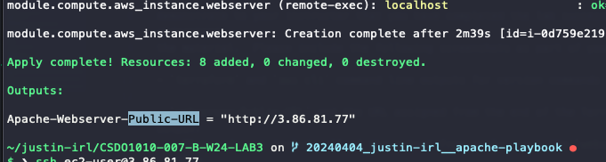
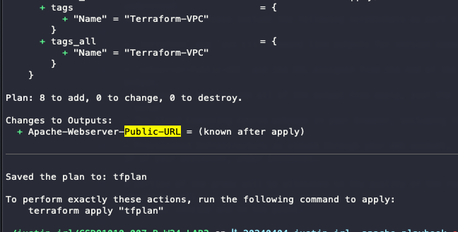
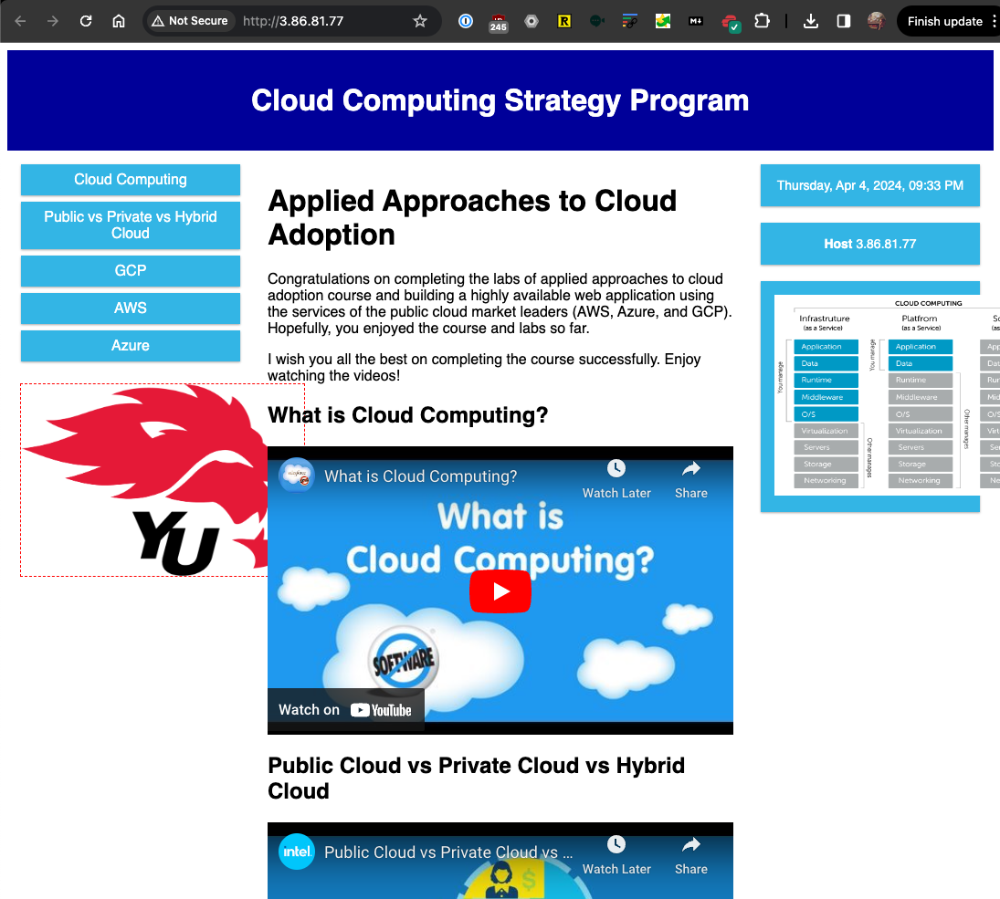
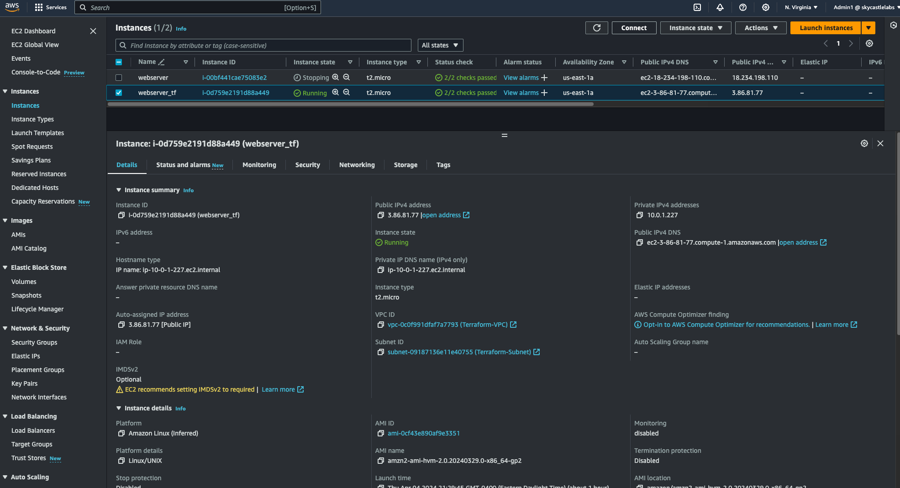
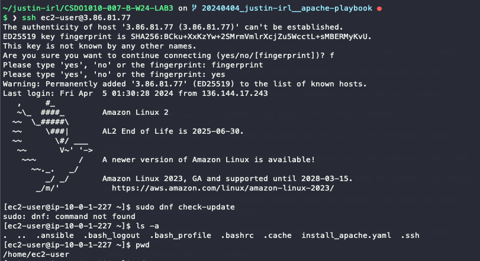
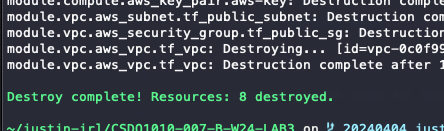

# CSDO1010-007-B-W24-LAB2 Report

## Task

- Manage AWS Infrastructure with Terraform (IaC) and Ansible (CM)

### Requirements

- `webserver-Public-URL` and the `URL` assigned from the end of the Terraform apply output.
  - Please do not include all of the output from apply, just the `webserver-Public-URL` value
- The Cloud Computing Course webpage in your browser, including the address bar showing the URL
- Provisioned Infrastructure as viewed through your AWS account, including the public IP of your `webserver`, under Instances
- `ls` command output from `putty` session to your EC2 instance to show folder contents.

## Report

- `webserver-Public-URL` and the `URL` assigned from the end of the Terraform apply output.  

  - I noticed in the doc, the steps for `fmt` and `plan` were not included. After running `plan` this is the message regarding the `URL`:  
  

- The Cloud Computing Course webpage in your browser, including the address bar showing the `url`  

- Provisioned Infrastructure as viewed through your AWS account, including the public IP of your webserver, under Instances.  

- `ls` command output from `putty` session to your EC2 instance to show folder contents.  

## Notes

- Similar to the previous lab, created & configured repo with `tfenv` and `tflint` and bumped to `tf 1.7.5` & `aws 5.43.0`
- Resources destroyed  

